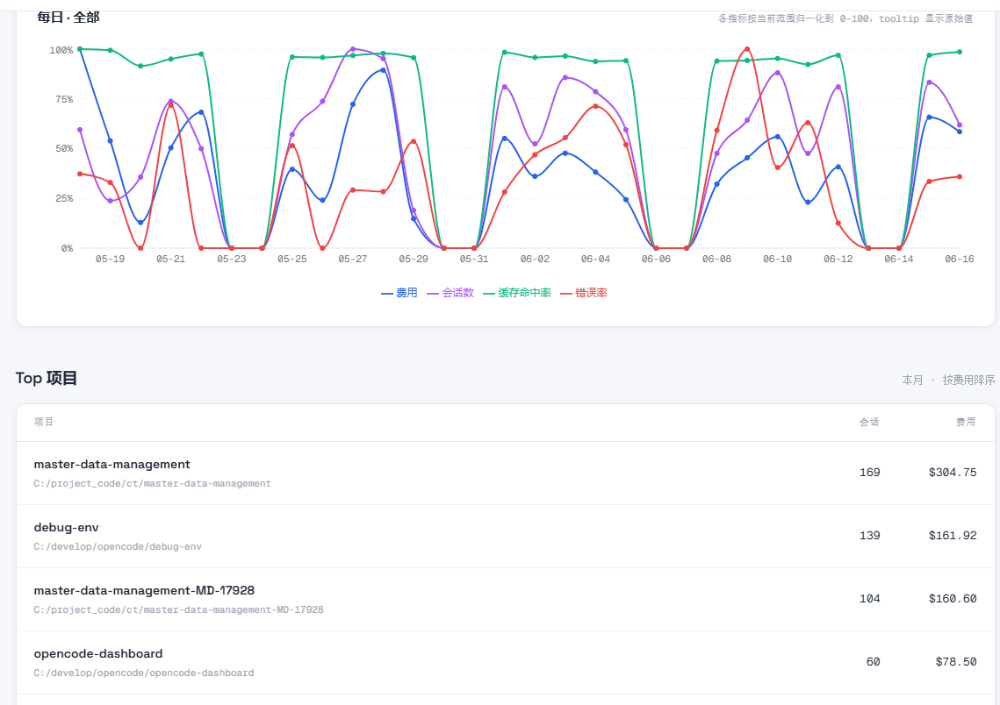
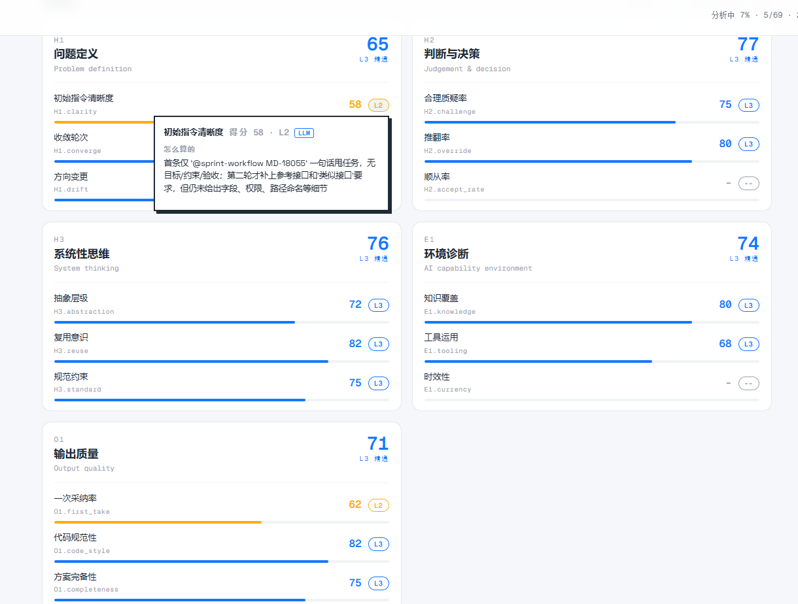
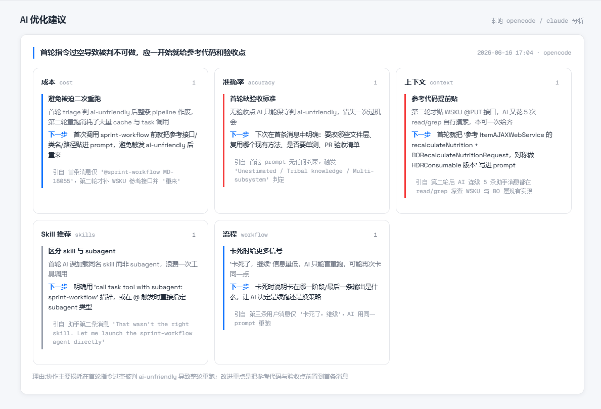

## 项目简介

`agentboss` 是一个**本地优先**的命令行工具（CLI: `aboss`），把 OpenCode / Claude Code 的会话数据 ETL 进本地 SQLite，提供一个 Web Dashboard，帮你回顾 AI agent 的工作表现：在哪些事上做得好、哪些事上踩了坑、时间花在了哪、应该怎么改进 prompt 和工作流。

所有数据都在本地（`~/.agent-boss/boss.db`），不上传任何东西。

## 解决什么问题

重度 AI 工具使用者面临「复盘困难」：大量时间、Token、费用像流水般消失却无法定位有效产出；反复沟通纠错的隐形损耗从未被量化；年终总结想写 AI 协作的能力成长，却发现它在传统评价体系里找不到坐标。

## 怎么解决

一个本地运行、专注复盘和提升人机协作效能的个人成长引擎。构建自动化优化闭环：**数据监测 → 效能诊断 → 自进化 → 能力模型与 AI 环境雷达 → 持续成长**。从「凭感觉用 AI」走向「用数据驾驭 AI」。

## 关键亮点

- **协作效能可视化**：卡点 / 时间 / Token / 费用全透明，识别无效产出（需求推翻、需求漂移），看清效能分布。
- **能力镜像**：AI 分析交互内容，生成深层能力雷达图与成长曲线，让 AI 无法替代的能力可量化、可追溯。
- **AI 诊断**：评估知识储备、工具调用与输出质量，精准定位短板并给出可执行优化路径。
- **自进化引擎**：检测瓶颈（如缺项目背景导致需求澄清过长），自动生成优化建议并一键应用为系统指令。

## 差异化优势

- 不做聊天框，做协作教练
- 不止统计，更驱动成长
- 本地优先，数据可控

## 安装

```bash
npm install -g agentboss
```

需要 Node.js >= 18。

## 使用

```bash
aboss              # 启动服务并自动打开浏览器（默认 http://localhost:3141）
aboss -p 4000      # 指定端口
aboss --no-open    # 启动但不自动打开浏览器
```

首次启动时会自动扫描本地 OpenCode / Claude Code 的会话数据库，做一次同步，然后在后台跑分析任务。

## 依赖

- 至少安装了 [OpenCode](https://opencode.ai) 或 [Claude Code](https://docs.anthropic.com/claude/docs/claude-code) 中的一个，并产生过会话数据
- 分析功能会调用你本地的 `opencode` 或 `claude` 命令作为 LLM judge（不需要额外配置 API key）

## Demo / 截图




