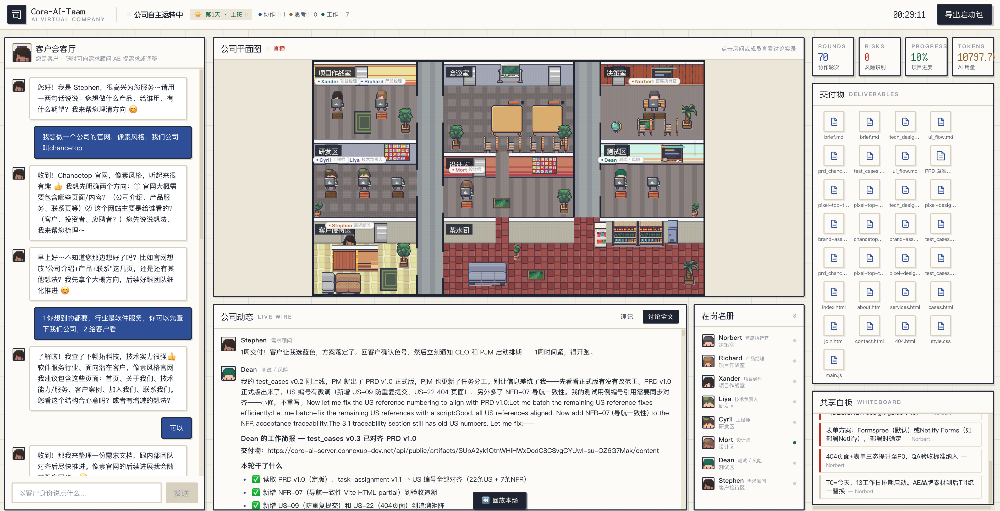

## The problem

Personal code agents like Claude Code / Codex only help "one person" write code faster — they can't carry the "whole job" from requirements to product to QA sign-off on your behalf.

## How it works

As the "client," you hand a one-sentence requirement to the front-desk requirements consultant (AE). Inside the company, **8 role agents** — CEO, product, project manager, tech lead, engineer, designer, QA and AE — autonomously discuss, hold meetings, disagree, make decisions and produce work just like a real company, ultimately delivering complete results from PRD and technical design all the way to a **real, runnable code repository**.

## Highlights

- **You're the client/observer, not the operator**: hand over a single goal, and watch in real time how the organization collaborates via a map, an activity feed and a shared whiteboard.
- **No hard-coded script**: when to meet, who to talk to, and when to produce are all decided autonomously by the agents at every tick and emerge from there; whenever the client chimes in, it propagates naturally through the organization.
- **A company that delivers**: the QA agent signs off item by item against the requirements, sending substandard work back for rework — not just a lively group chat.

## Hard results

| 8 | 4 people + CC | 1.5 days | ~11,000 |
| :--: | :--: | :--: | :--: |
| role agents | dev team | 147 commits | lines of code |

## Product preview

