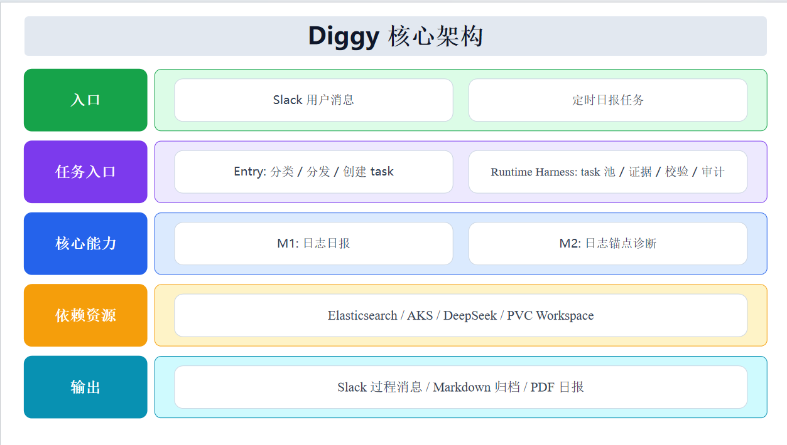

<section class="diggy-hero">

CT 2026 Hackathon
<h1 class="diggy-title">Diggy</h1>
<strong>An evolving DevOps AI agent</strong>Turn an engineer's ability to dig through logs, watch metrics and locate problems into a service anyone can use, available on demand, with verifiable conclusions.

<b>Team</b> Bring the Flair<b>Members</b> Miller / Simon / Brooker<b>Award</b> 3rd Place

<a class="diggy-btn primary" href="https://app.slack.com/client/T0AQB187MPX/C0B98MCJYM7" target="_blank" rel="noreferrer">Open Slack to use Diggy</a><a class="diggy-btn secondary" href="#m1">See how M1 works first</a><a class="diggy-btn secondary" href="#m2">Then see how M2 works</a>

Currently supports the FBR workspace only

</section>

<section class="diggy-card span-12">
<h2>Pain points</h2>
Closing the last mile between data and development

Scene 01
<h3>A developer's morning</h3>
You want to know whether yesterday's service was stable — but you have to open Kibana by hand, write the query, read the results, and draw your own conclusion.
Hand it to Diggy

Scene 02
<h3>Pre-release check</h3>
You want a quick look at the error trend over the past few days, but you have to query multiple indices and compare and judge them yourself.
Hand it to Diggy

Scene 03
<h3>Slack alert</h3>
An alert fires in the middle of the night, or you're away from your computer — it's hard to give a rough cause in a short time.
Hand it to Diggy

Scene 04
<h3>An error-log link</h3>
A colleague tosses you an error-log link, but you can't analyze it right away or give even a rough conclusion immediately.
Hand it to Diggy

</section>
<section class="diggy-card span-12">
<h2>Showcase</h2>
The automated path from data to conclusion

The team isn't short on data or query skills, and infrastructure like ES / Kibana / AKS is already mature. What's truly missing is the <strong>automated path from data to conclusion</strong>. Diggy unifies the entry point into Slack, lets users trigger analysis with one sentence, and lets the system thread logs, metrics, evidence chains and conclusions into one traceable path.

1

<h3>M1 time-window report</h3>
Enter a time range in natural language; it automatically aggregates logs, generates a health report, then runs entity validation to avoid LLM-fabricated results.

2

<h3>M2 anchor diagnosis</h3>
Enter a Kibana link or alert ID; it gathers evidence round by round, refutes hypotheses, converges the evidence, and finally outputs a traceable diagnostic report.

3

<h3>Runtime Harness</h3>
Four gates — Task / Tool / Evidence / Schema + Audit — corral the LLM's actions into a deterministic flow while preserving a full audit trail.

</section>
<section class="diggy-card span-12">
<h2>Deliverables</h2>
Repo, deck and speech script, all ready to open or download

GitHub repository

Browse the source code, commit history and full project content.
<a class="diggy-btn secondary" href="https://github.com/2026hackathon/diggy" target="_blank" rel="noreferrer">Open repo</a>

Demo deck

Download the PPTX file used for the live demo.
<a class="diggy-btn secondary" href="diggy.pptx" download>Download deck</a>

Speech script

Download the companion script, handy for review, walkthroughs and re-sharing.
<a class="diggy-btn secondary" href="diggy_speech.doc" download>Download script</a>

</section>
<section class="diggy-card span-12 slack-card"><h2>Call Diggy right inside Slack</h2>
No need to open Kibana and multiple dashboards — just <strong>@Diggy</strong> in Slack with a natural-language request to generate a time-window report or a key-point diagnosis. Every conclusion keeps its evidence chain, so the team can review and keep investigating.
<a class="diggy-btn secondary" href="https://app.slack.com/client/T0AQB187MPX/C0B98MCJYM7" target="_blank" rel="noreferrer">Open in Slack</a></section>
<section class="diggy-card span-12" id="m1">
<h2>How to use M1</h2>
A video demo of the full trigger flow for a time-window report

<b>Step 1: Ask in Slack</b>e.g. "analyze the logs from the past three days for me," or "check whether the service was stable yesterday."

<b>Step 2: Generate a health report</b>The system first parses the time range and runs ES aggregation, then reports the anomaly count, top services and risk points.

<b>Step 3: Validate the data</b>Once the report is done, it validates that service names, error codes and numbers all trace back to the original aggregation results.

M1's core value is fast and trustworthy: conclusions come from the data, and the LLM only understands and summarizes. The video cover shows the final report's reading form — click to watch the full trigger flow.

<video controls preload="metadata" playsinline poster="projects/diggy/M1.png"><source src="m1.mp4" type="video/mp4"></video>
</section>
<section class="diggy-card span-12" id="m2">
<h2>How to use M2</h2>
A video demo of the round-by-round evidence-gathering diagnostic path

<b>Step 1: Provide an anchor</b>Paste a Kibana link, traceId or alert ID, and Diggy first builds an evidence pool.

<b>Step 2: Propose a hypothesis</b>The model proposes the next evidence-gathering direction based on the evidence, rather than handing back a black-box conclusion all at once.

<b>Step 3: Converge on a result</b>Each round of evidence refutes or supports the hypothesis, ultimately forming a citable, auditable root-cause analysis.

M2's core value is traceability: the video cover shows the diagnostic report's result form — click to watch the full process from anchor to evidence-chain convergence.

<video controls preload="metadata" playsinline poster="projects/diggy/M2.png"><source src="m2.mp4" type="video/mp4"></video>
</section>
<section class="diggy-card span-12" id="tech">
<h2>Technical details</h2>
M1 uses deterministic aggregation for a trustworthy report; M2 uses round-by-round evidence gathering for a traceable diagnosis

M1 · time-window report
<h3>Turn natural language into a verifiable log report</h3>
M1's design principle: AI handles understanding and expression, while the deterministic system handles facts and numbers. A user types "analyze the logs from the past three days" in Slack, and the system handles the time window, aggregation results, health scoring and report generation separately.

<b>Input:</b> a natural-language Slack request; the LLM only parses the time range and intent.<b>Facts:</b> ES aggregation produces the anomaly count, top services, error codes and trends — numbers are not left to the LLM to compute.<b>Grading:</b> code computes the health score and risk grade, baking explainable rules into the flow.<b>Validation:</b> entity validation prevents fabrication — service names, error codes and numbers must trace back to the ES aggregation results.<b>Output:</b> Slack progress messages plus a Markdown / PDF report, with reviewable conclusions.

M2 · anchor diagnosis
<h3>Propose a hypothesis first, then converge on the root cause with evidence</h3>
M2 doesn't let the model guess the root cause directly — it has the model propose a hypothesis + gap, then choose the next evidence-gathering tool. Each round of evidence supports or refutes the hypothesis, and the final conclusion must be backed by citations to the raw logs.

<b>Input:</b> a Kibana link, alert ID or traceId, to lock the diagnostic anchor first.<b>Evidence pool:</b> collects raw logs, traceId, error messages, instance lists and counter-evidence records.<b>Tools:</b> a restricted ES / AKS / mock tool layer executes by fixed signatures, with no unbounded search.<b>Convergence:</b> a hypothesis supported by evidence goes deeper, one refuted by counter-evidence switches to H2 / H3, and insufficient evidence continues to the next round.<b>Output:</b> a diagnostic report with raw-log citations and an audit trail, to aid judgment rather than replace human decisions.

Core architecture
<h3>The Slack entry routes first, then enters the Runtime Harness</h3>

</section>
<section class="diggy-card span-12">
<h2>How we constrain agent behavior</h2>
A two-layer closed loop of Coding Harness and Runtime Harness

Coding Harness
<h3>First converge the dev process into acceptance-ready tasks</h3>
We don't just let AI write code freely — we use the hx flow to lock down the task, context, tests and DoD.

hx go: pick up a task card, converge scope firsthx task start: open a worktree, isolate parallel developmenthx spec / hx check: accept against the spec, always run checks when donehx eval / hx testgen: run evals before changing a prompt, generate cases for critical modules firsthx task done: produce a DoD report and traceable commits

Runtime Harness
<h3>Then corral runtime behavior into four gates</h3>
When actually handling a user request, the LLM only understands and chooses a strategy, while task state, tool calls, evidence citations and report publishing are all gated by deterministic code.

Task Gate: create the task directory first, with clear pending / running / doneTool Gate: every tool call must carry a hypothesis + gapEvidence Gate: a ToolResult citation enters the pool; no match, no entry into the reportSchema + Audit Gate: pass the schema first, then publish; audit.jsonl traces the whole way

The core of these two harness layers: not making the model more obedient, but making the process not depend on the model being obedient.
</section>

