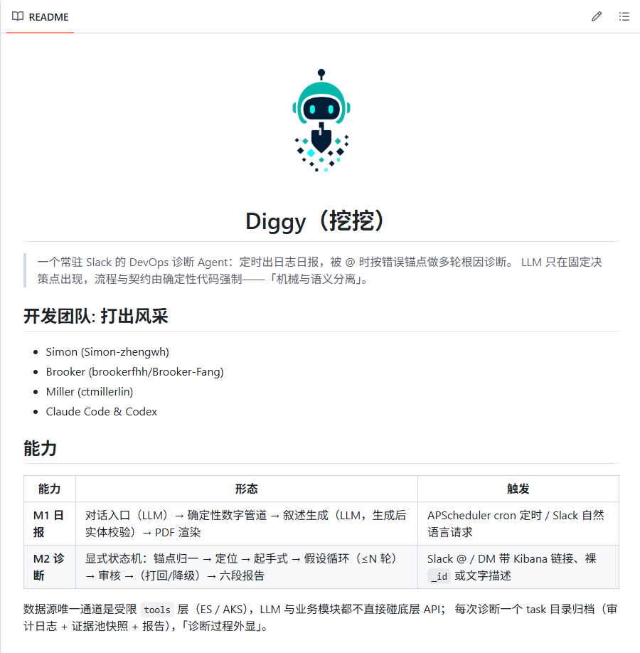
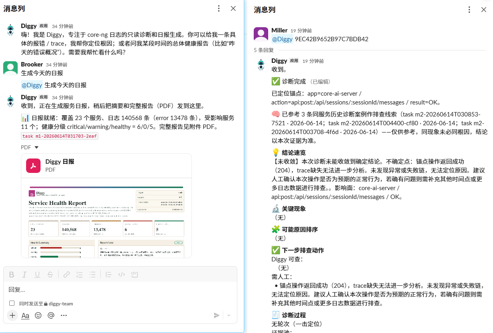

## 解决什么问题

团队不缺数据和查询技巧（ES-Kibana-AKS 等基础设施已很完善），真正缺的是「从数据到结论的自动化路径」：早晨想知道服务稳不稳要手动开 Kibana 写查询；发布前看错误趋势要查多个 index 自己比对；半夜告警人不在电脑前；同事甩来一条错误日志却没法马上分析。

## 怎么解决

以 Slack 为统一入口（@Diggy 一句话即可触发），提供两条核心产品链路：

- **M1 时间窗报告**：自然语言问时间范围，自动聚合日志生成健康报告。
- **M2 锚点诊断**：输入 Kibana 链接或告警 ID，逐轮取证、收敛假设，生成可溯源的诊断报告。

## 关键亮点

- **快 / 准 / 不越位**：极大缩短发现问题到拿到结论的时间；结论可追溯可验证；只做分析者与建议者，不替代人的最终决策。
- **Runtime Harness**：用 Task / Tool / Evidence / Schema+Audit 四道 Gate 硬约束 Agent 行为，全程 audit 留痕。
- **LLM 负责理解，代码负责事实**：所有数字来自 ES 聚合结果，LLM 不参与计算；报告生成后做实体校验，防编造。
- **逐轮取证而非黑盒推理**：模型提出假设、选择下一步取证，每轮证据收敛或推翻假设，结论必须被原始日志引用支撑。

## 硬核成果

| 515 | 162 | 61 | 0 |
| :--: | :--: | :--: | :--: |
| 自动化测试用例 | 次提交 | 份报告 | 手写业务代码 |

## 概览

## Demo 视频

**M1 · 时间窗报告**

<video src="m1.mp4" controls preload="metadata"></video>

**M2 · 锚点诊断**

<video src="m2.mp4" controls preload="metadata"></video>
