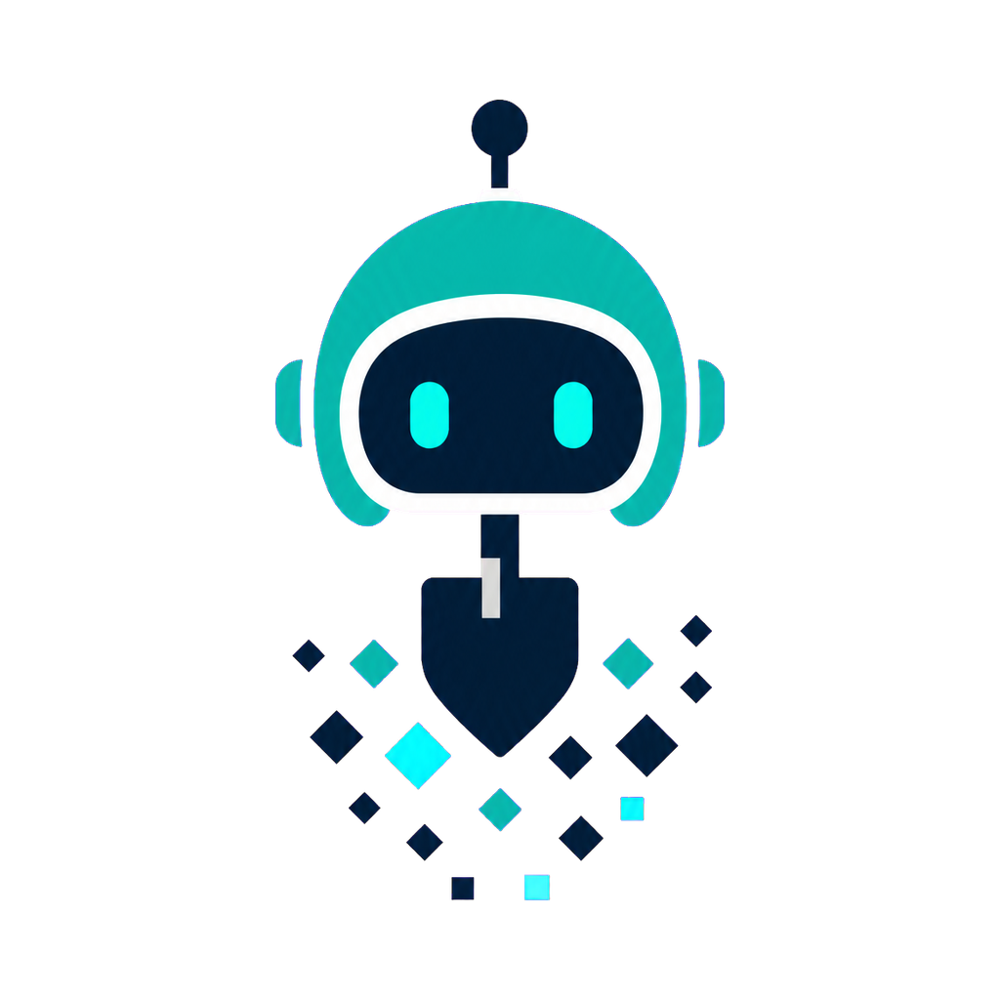
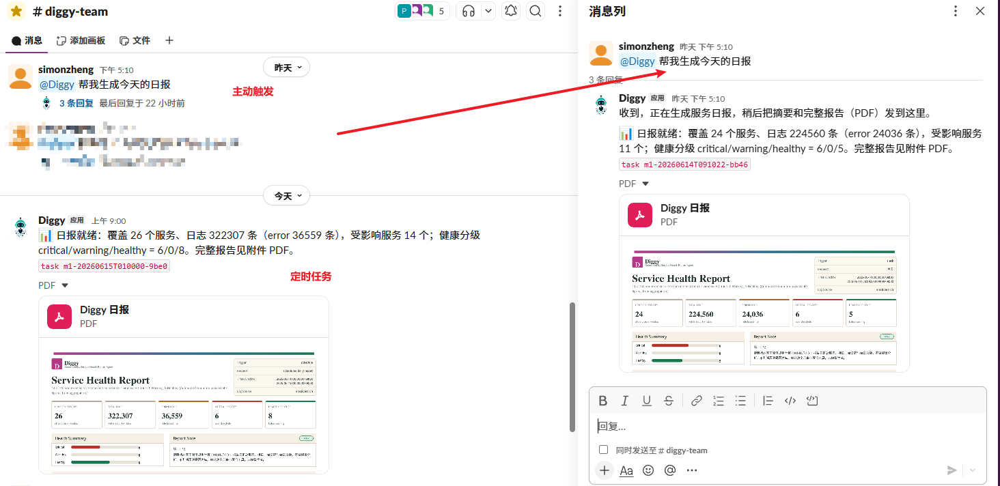
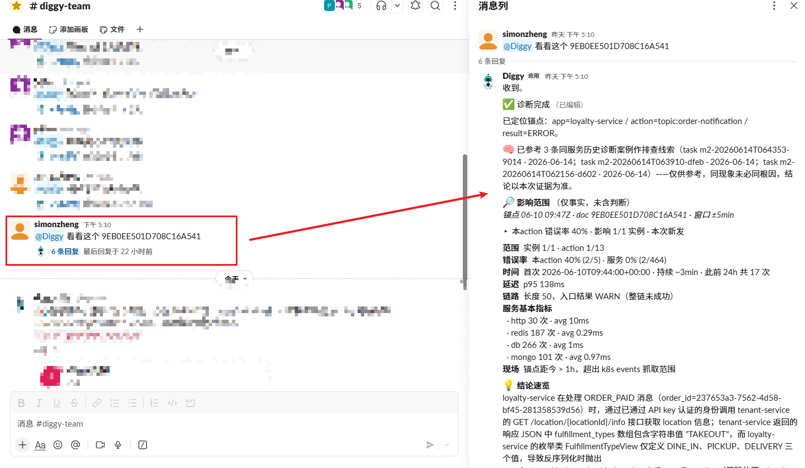
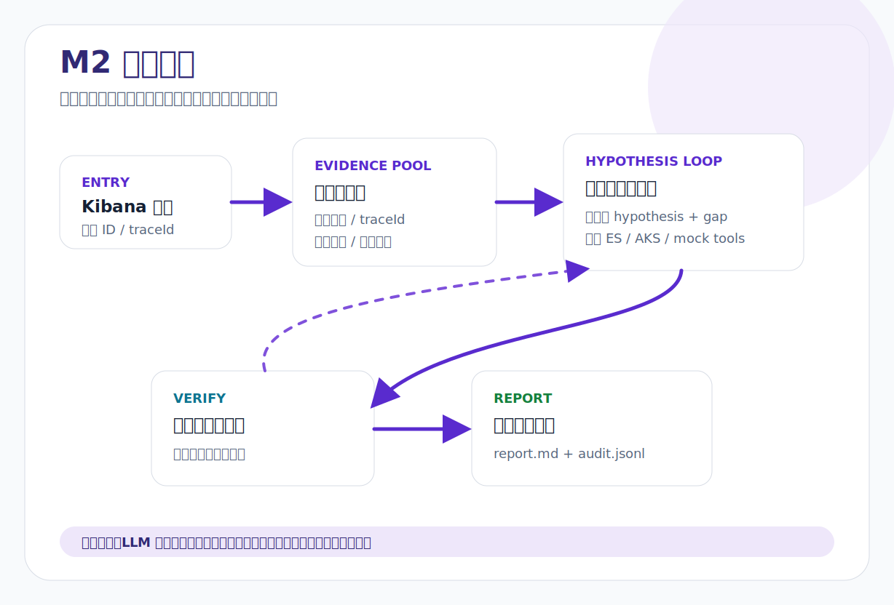

<section class="diggy-hero">

CT 2026 Hackathon
<h1 class="diggy-title">Diggy 挖挖</h1>
<strong>可进化的 DevOps AI Agent</strong>把开发工程师查日志、看指标、定位问题的能力，变成人人可用、随叫随到、结论可验证的服务。

<b>队名</b> 打出风采<b>成员</b> Miller / Simon / Brooker<b>奖项</b> 第三名

<a class="diggy-btn primary" href="https://app.slack.com/client/T0AQB187MPX/C0B98MCJYM7" target="_blank" rel="noreferrer">点击进入 Slack 使用 Diggy</a><a class="diggy-btn secondary" href="#m1">先看 M1 使用方式</a><a class="diggy-btn secondary" href="#m2">再看 M2 使用方式</a>

</section>

<section class="diggy-card span-12">
<h2>项目痛点</h2>
打通数据和研发的最后一公里

场景 01
<h3>开发的早晨</h3>
想知道昨天服务稳不稳，需要手动打开 Kibana，写查询、看结果，再自己得出结论。
交给 Diggy

场景 02
<h3>发布前检查</h3>
想快速看最近几天的错误趋势，需要查多个 index，自己比对、自己判断。
交给 Diggy

场景 03
<h3>Slack 告警</h3>
半夜告警来了，或者人不在电脑前，很难在短时间内给出大概原因。
交给 Diggy

场景 04
<h3>错误日志链接</h3>
同事甩来一条错误日志链接，但没办法马上分析，也没法立即给出大概结论。
交给 Diggy

</section>
<section class="diggy-card span-12">
<h2>项目展示</h2>
从数据到结论的自动化路径

团队不缺数据和查询技巧，ES / Kibana / AKS 等基础设施也已经很完善。真正缺的是<strong>从数据到结论的自动化路径</strong>。Diggy 把入口统一到 Slack，让用户用一句话触发分析，让系统把日志、指标、证据链和结论串成一条可回溯的链路。

1

<h3>M1 时间窗报告</h3>
自然语言输入时间范围，自动聚合日志，生成健康报告，再做实体校验，避免 LLM 编造结果。

2

<h3>M2 锚点诊断</h3>
输入 Kibana 链接或告警 ID，逐轮取证、推翻假设、收敛证据，最后输出可追溯的诊断报告。

3

<h3>Runtime Harness</h3>
Task / Tool / Evidence / Schema + Audit 四道 Gate 把 LLM 的动作收束到确定性流程里，保留完整审计痕迹。

</section>
<section class="diggy-card span-12">
<h2>交付资源</h2>
仓库、PPT 和演讲稿都可直接打开或下载

GitHub 仓库

查看源代码、提交历史和完整项目内容。
<a class="diggy-btn secondary" href="https://github.com/2026hackathon/diggy" target="_blank" rel="noreferrer">打开仓库</a>

演示 PPT

下载现场演示使用的 PPTX 文件。
<a class="diggy-btn secondary" href="diggy.pptx" download>下载 PPT</a>

演讲稿

下载配套讲稿，便于复盘、讲解和二次传播。
<a class="diggy-btn secondary" href="diggy_speech.doc" download>下载讲稿</a>

</section>
<section class="diggy-card span-12 slack-card"><h2>在 Slack 里直接调用 Diggy</h2>
不用打开 Kibana 和多个仪表盘，在 Slack 里 <strong>@Diggy</strong> 发一句自然语言请求，就可以生成时间窗报告或键点诊断结果。所有结论都保留证据链，便于团队复核和继续排查。
<a class="diggy-btn secondary" href="https://app.slack.com/client/T0AQB187MPX/C0B98MCJYM7" target="_blank" rel="noreferrer">打开 Slack 使用</a></section>
<section class="diggy-card span-12" id="m1">
<h2>M1 如何使用</h2>
截图 + 视频，先看时间窗报告

<b>Step 1: 在 Slack 里提问</b>例如：帮我分析近三天日志，或帮我看昨天服务是否稳定。

<b>Step 2: 生成健康报告</b>系统先做时间范围解析和 ES 聚合，再给出异常数量、Top 服务和风险点。

<b>Step 3: 做数据校验</b>报告完成后校验服务名、错误码和数字是否都能回到原始聚合结果。

M1 的核心价值是快而可信：结论来自数据，LLM 只负责理解和总结。截图展示最终报告的阅读形态，视频用于看完整触发过程。

<video controls preload="metadata" playsinline poster="projects/diggy/M1.png"><source src="m1.mp4" type="video/mp4"></video>
</section>
<section class="diggy-card span-12" id="m2">
<h2>M2 如何使用</h2>
截图 + 视频，逐轮取证的诊断链路

<b>Step 1: 输入锚点</b>贴入 Kibana 链接、traceId 或告警 ID，Diggy 会先建立证据池。

<b>Step 2: 提出假设</b>模型根据证据提出下一步取证方向，而不是一次性黑盒给结论。

<b>Step 3: 收敛结果</b>每轮证据都会推翻或支持假设，最终形成可引用、可审计的根因分析。

M2 的核心价值是可追溯：截图展示诊断报告的结果形态，视频展示从锚点到证据链收敛的完整过程。

<video controls preload="metadata" playsinline poster="projects/diggy/M2.png"><source src="m2.mp4" type="video/mp4"></video>
</section>
<section class="diggy-card span-12" id="tech">
<h2>技术细节</h2>
把 AI 约束进可验证流程

Task Gate
<h3>任务先建目录</h3>
收到请求后先进入任务态，明确 pending / running / done，再异步执行。

Tool Gate
<h3>带假设再取证</h3>
LLM 想调工具时必须带 hypothesis + gap，避免无边界搜索。

Evidence Gate
<h3>证据入池</h3>
ToolResult 的引用进入 EvidencePool，未命中的证据不参与审核。

Schema + Audit Gate
<h3>先校验，再发布</h3>
报告先过 schema，audit.jsonl 全程留痕，Slack thread 中看到的是可追溯结果。

</section>
<section class="diggy-card span-12">
<h2>我们如何约束 Agent 行为</h2>
Coding Harness 和 Runtime Harness 的双层闭环

Coding Harness
<h3>先把开发过程收敛成可验收任务</h3>
我们不是直接让 AI 自由写代码，而是用 hx 流程把任务、上下文、测试和 DoD 全部固定下来。

hx go：领取任务卡，先收敛范围hx task start：开 worktree，隔离并行开发hx spec / hx check：按规格验收，完成后必跑检查hx eval / hx testgen：改 prompt 先跑评估，关键模块先生成用例hx task done：生成 DoD 报告和可追溯 commit

Runtime Harness
<h3>再把运行时行为收束到四道 Gate</h3>
在真正处理用户请求时，LLM 只负责理解和选择策略，任务状态、工具调用、证据引用和报告发布都由确定性代码把关。

Task Gate：先建任务目录，明确 pending / running / doneTool Gate：调工具必须带 hypothesis + gapEvidence Gate：ToolResult 引用入池，不命中不进报告Schema + Audit Gate：先过 schema，再发布，audit.jsonl 全程留痕

这两层 harness 的核心是：不是让模型更听话，而是让流程不依赖模型听话。
</section>

