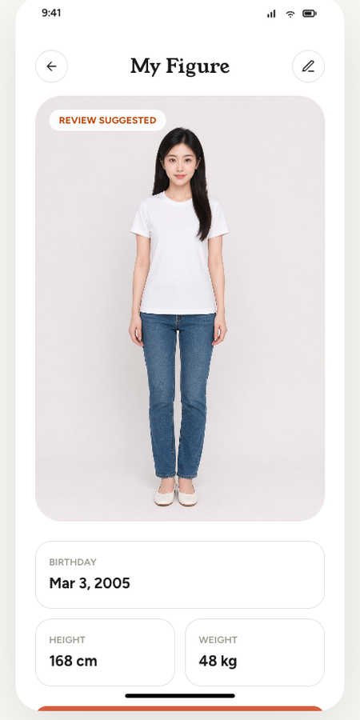
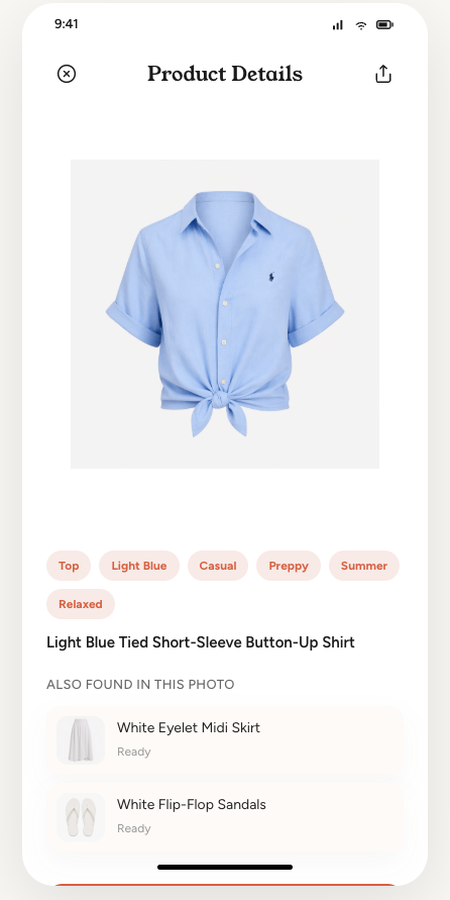
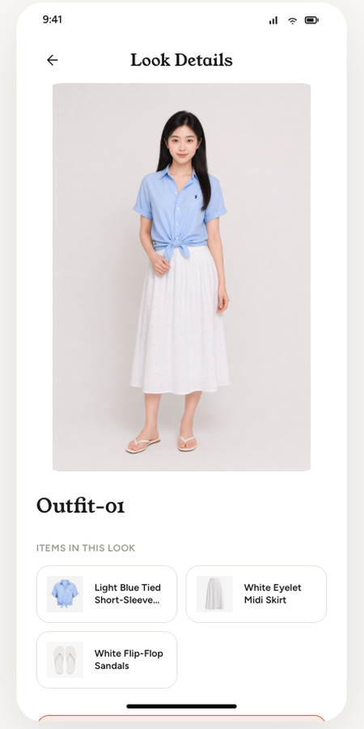
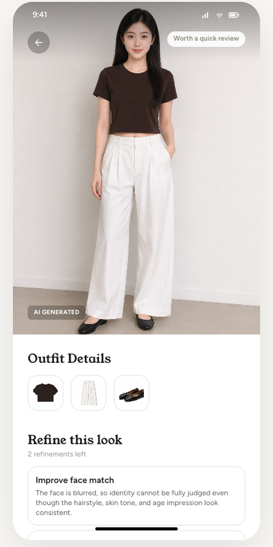
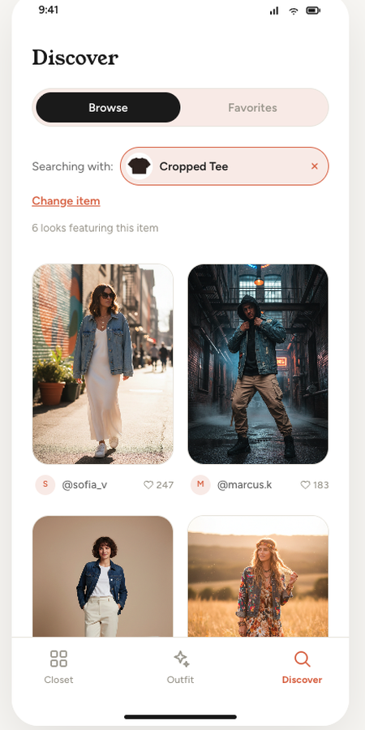

## The problem

Your closet is full, yet you keep forgetting what you own; you see an outfit you love but don't know if you can recreate it; you buy something new and have no idea how to pair it with your old clothes. Every morning, "what to wear" becomes endless deliberation — and you end up back in the same few familiar outfits.

## How it works

Drape turns your existing wardrobe into an AI closet you can try on, mix and match, and find inspiration in. You first create a reusable Figure from an AI-generated front-facing photo, then capture your clothes by photo; the system automatically cuts them out, recognizes category / color / style tags, and supports trying on multiple garments together. The AI Stylist first picks pieces from your closet to give advice, while Discover connects community inspiration back to your own clothes.

## Highlights

- **AI Figure**: upload a front-facing photo and basic body info to generate a reusable try-on model; the demo uses an AI-generated avatar to avoid real privacy risks.
- **Garment productization**: shoot or upload from your album, and AI automatically detects the garment, removes the background, adds studio light, and generates category, color, scene and style tags.
- **Multi-piece virtual try-on**: pick a top, bottom, shoes and more from your closet, generate a complete outfit in one click, and save the look.
- **AI Stylist**: describe a scene in natural language, e.g. "casual weekend," and the system first digs through your wardrobe to recommend a full outfit, then tries it on directly.
- **Discover inspiration loop**: browse community outfits, or search for featuring looks based on a specific garment — bringing inspiration back to your existing closet instead of straight into impulse buying.

## Screenshots

## Product components

| Figure | Closet | Try-on | AI Stylist | Discover |
| --- | --- | --- | --- | --- |
| AI body profile — the model baseline for all later try-ons | Garment intake, AI cutout, productized tags, category management | Combine multiple pieces into a full outfit and save it as a Look | Natural-language styling assistant starting from your own closet | Community inspiration feed + similar-outfit search for a chosen garment |

## Hard results

| 5 | 3 | 6 |
| :--: | :--: | :--: |
| core user flows | pieces combinable per try-on | inspiration-look examples per garment |

## What sets it apart

- Closet-first, no upselling
- Reusable Figure
- Closed loop from intake to try-on
- AI suggestions render directly as on-body results
- Generated results come with a review / refine mindset

## Tech stack

`Next.js 15 + React 19` · `OpenAI Agents SDK` · `Azure OpenAI` · `Prisma + SQLite` · orchestration is deterministic code, not an agent
