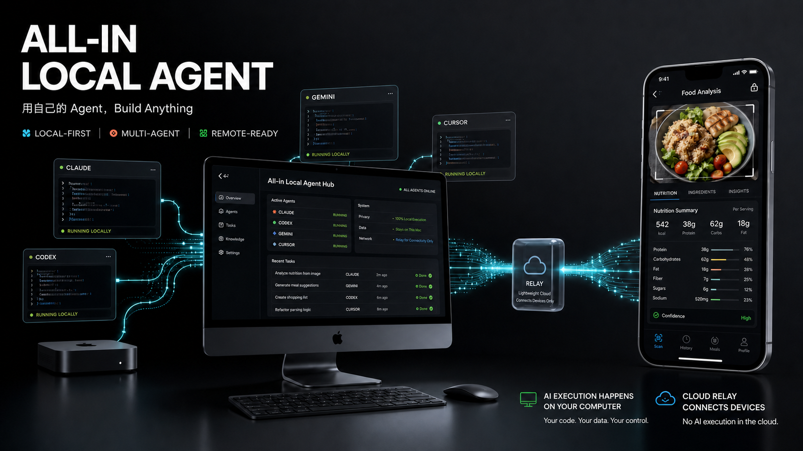

## The problem

Users have already installed and signed into coding agents on their own machine — Claude Code, Codex, Gemini CLI, Cursor and more — but these capabilities are scattered, can't be managed uniformly, and certainly can't be called from a local UI or remotely (e.g. from a phone).

## How it works

Bring the agents, accounts and runtimes already on your machine into a single desktop Hub, and expose them through one Gateway API so a local UI or a remote mobile app can call them. AI inference and tool execution all happen on the user's own computer; the cloud Relay only connects devices and forwards messages — it provides no AI inference.

## Highlights

- **Local-first**: reuses the coding agents, accounts and runtimes already on your machine; data never leaves it.
- **Multi-agent**: discovers and manages multiple Agent Runtimes uniformly, composing them into a collaborative group chat via Roles.
- **Structured tasks**: validates agent output into results conforming to a JSON Schema, re-asking and retrying on a miss.
- **Remote-ready**: a mobile app calls the local agent through the Relay, and can reconcile task results even after a reconnect.
- **Protocol boundary**: terminates the differences between ACP and each adapter inside the daemon, presenting a stable Gateway API to clients.

## Product components

| Module | Responsibility |
| --- | --- |
| **Hub** | Electron desktop app · runtime/role management, multi-agent group chat, device pairing |
| **Daemon** | Process supervision · Session / StructuredExchange / Task / permission policy |
| **Protocol** | TypeScript contract package · Gateway API, Relay frames, DTOs, error codes |
| **SDK** | RN-compatible · pairing, task submission, progress subscription, reconnect reconciliation |
| **Relay** | Node WebSocket · connection management, routing/forwarding, rate limiting |
| **Nutrition App** | First remote scenario · snap a photo of food, get structured nutrition analysis |

## Product preview

