# MenuPilot · AI 菜单增长模拟器

> 🏆 **公司内部 Hackathon 2026 · 二等奖**  
> 队「爱吃香菜」| 主理人 Lim Chen（SOLO LEAD）+ Claude agent team

---
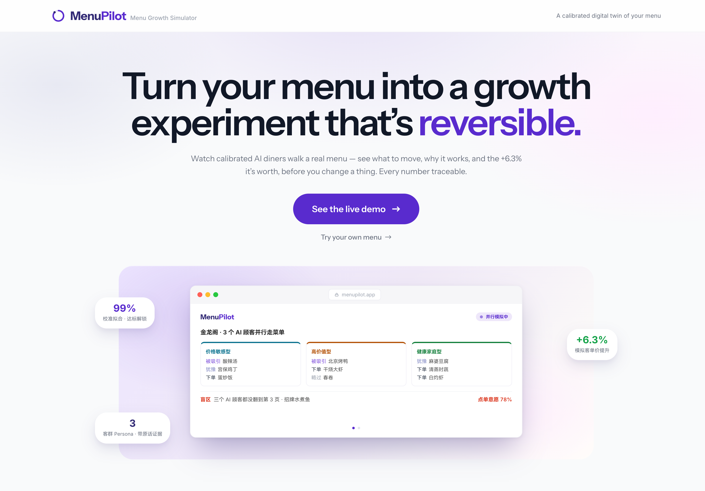
## 解决什么问题

餐厅老板改菜单——挪一道菜的位置、调一个价格——全靠拍脑袋。上个月把招牌菜从黄金区挪到角落，这个月流水掉了，他永远不会知道是不是这一下。连锁品牌有数据团队做菜单工程，但街边小店没有实验流量、跑不了真实 A/B 测试。改错了，一个月后才知道，还回不去。

而菜单是餐厅**零成本可改的最大利润杠杆**——做对一次菜单工程，利润提升空间 **10–15%**（菜单工程师 Gregg Rapp）。但顾客平均只看菜单 **109 秒**（Gallup 调查），埋在第 3 页的招牌菜几乎没人翻到。

## 怎么解决

**构建预演模拟器。** 先用这家店的历史销量把模拟器校准到"能复现过去"，才允许它预演未来。核心闭环：

```
上传菜单 → Persona 生成（真实评价聚类）→ 校准回测（销量当裁判，拟合≥85% 才解锁）
         → 并行模拟（3 类客群同时逛菜单，暴露盲区）
         → 策略建议（每条带可追溯证据链）→ 应用并对比（沙盒重模拟，不换菜不调价只改位置）
```

**双路径并存：**
- **校准沙盒**（主线）：有历史销量的店 → 全链路闭环 → 可预演"改了会怎样"
- **AI 评估**（第二路径）：无销量的店 → 一张菜单照片 → 即时 6 维结构体检（价格锚点 / 菜单广度 / 高契合菜曝光 / 客群覆盖 / 信息完整度 / 品类集中度）→ 零数据门槛 onboarding

## 核心技术深度

MenuPilot 的技术护城河不在某个单一算法，而在**把成熟方法拼成"先自证复现 → 再预测 → 可回测"的完整验证闭环**。刻意选择确定性方法（可复现、可审计、可解释），不做黑箱。

### 1. 校准门禁（最硬创新）

在三权重单纯形上做**确定性网格穷举**（步长 0.01，≈5151 组合），用 JSD 衡量模拟分布与真实销量的拟合度。**拟合 < 85% 不解锁、不回炉**——AI 输出被真实销量当裁判，不是模型自说自话。本项目实测拟合 **99.0%**，远超门禁。

### 2. 交叉验证（最锋利的证据）

评价聚类得到的客群占比 **40/32/28**，与纯粹为拟合销量搜出的混合权重 **[0.40, 0.30, 0.30]** 几乎重合——**评价不看销量，销量重建不看评价，两条独立证据链指向同一个三分构成**。这证明"3 个 AI 顾客代表真实客群"不是嘴上说的，是数据交叉验证出来的。

### 3. 内容 × 位置解耦

点单概率 = **base_p（LLM 内容偏好）× visibility（确定性位置物理）**，归一化。Visibility 是区位系数 × 页码系数的确定性查找表（如黄金区 top-right 1.0 → 底角 bottom-left 0.6，~1.6× 摇摆；页码 p1=1.0 → p3=0.35，~3× 摇摆）。**内容和位置解耦**是能回答"换个位置会怎样"的前提——LLM 只评内容偏好（schema 锁死），位置物理全交给确定性代码。

### 4. 6 维确定性诊断（0 LLM）

评估模式的价值不在单页照片的位置杠杆（仅 ~0.5%），而在**多维结构体检**：价格架构与锚点、菜单广度与决策负担（vs 注意力 K=12）、高契合菜曝光、客群覆盖、信息完整度（CJK 感知，拉丁菜单不误报缺英文名）、菜品同质化与品类集中度（HHI）。全部确定性算法，无 LLM 参与。

## 产品设计

- **双视觉域**：产品 UI（sans-serif, 亮底品牌紫）与菜单画布（serif 衬线 + 暖纸底色 + 金色虚线）刻意分离——"分析工具"与"被分析对象"一眼可分
- **渐进披露**：7 步 wizard，每步完成后才解锁下一步（门禁式 gating），同一屏至多一个推进入口
- **Ghost 空白态**：每个步骤的初始空白态不是空卡片——底层铺骨架预告即将出现的内容
- **可解释性标签**：成本标注来源（owner_input），AI 做的事 vs 确定性代码做的事用三色 legend 区分
- **断网零 CDN**：字体 woff2 本地打包，确定性计算全放前端，离线 fixture 兜底
- **动效 ≤600ms**：全部 CSS @keyframes，服务叙事不炫技，prefers-reduced-motion 全部停掉

## 业务落地

- **Menu Report v2** 已上线，有真实用户；MenuPilot 补上"持续预演"缺口——Report 拉新入驻、MenuPilot 持续预演，互补不替代
- 对齐 connexup 既有 **Menu AI Agent PRD**（v0.1，PMF 阶段要在种子用户验证）——MenuPilot 正是这条用例的先行验证
- 换真实 POS 导出（一张"菜品 × 销量"表），**管线一行不改**

## 关键数字

| 指标 | 数值 |
|------|------|
| 校准拟合度 | **99.0%**（网格穷举全局最优，门禁 85%） |
| 模拟客单价提升 | **+6.3%**（$21.13 → $22.46，只改位置、不换菜不调价） |
| 交叉验证 | 40/32/28 ≈ [0.40, 0.30, 0.30]（两条独立路径趋同） |
| 6 维诊断 | 0 LLM，确定性算法 |
| Persona | 3 类（靛青价格敏感型 / 琥珀高价值型 / 绿健康家庭型），从真实评价聚类 |
| 前端原型 | 11 屏端到端，走通校准 + 评估双路径 |

## 实现方式

**1 人主理 + Claude agent team（3 agent 并行）。** 三个 agent（team-lead / frontend / ppt）各自独立上下文、按冻结契约并行交付。vibecoding 的核心不是让 AI 写代码，是管理上下文、用契约把活拆开、让每个角色只看见该看见的。一个人，放大成一支队伍。

前端: Next.js + React + TypeScript · 后端: Python FastAPI + NumPy · LLM: 百炼 qwen-vl-ocr + Azure GPT · RAG: ChromaDB · 100% 离线可演示。

## 相关资源

- 📂 [源码仓库](https://github.com/2026hackathon/menupilot)
- 🎨 [设计系统 skill](https://github.com/2026hackathon/menupilot-design) — 提取为可复用 Claude Code skill（视觉 token + 组件模式 + 幻灯片全链路）
- 📊 [演讲 PPT](https://github.com/2026hackathon/menupilot/blob/master/ppt/menupilot-deck.html) — 日光精密仪器语法, 11 页 + 算法附录

---

## Demo 视频

<video src="demo.mp4" controls preload="metadata" width="100%"></video>

## 交互原型 · 11 屏


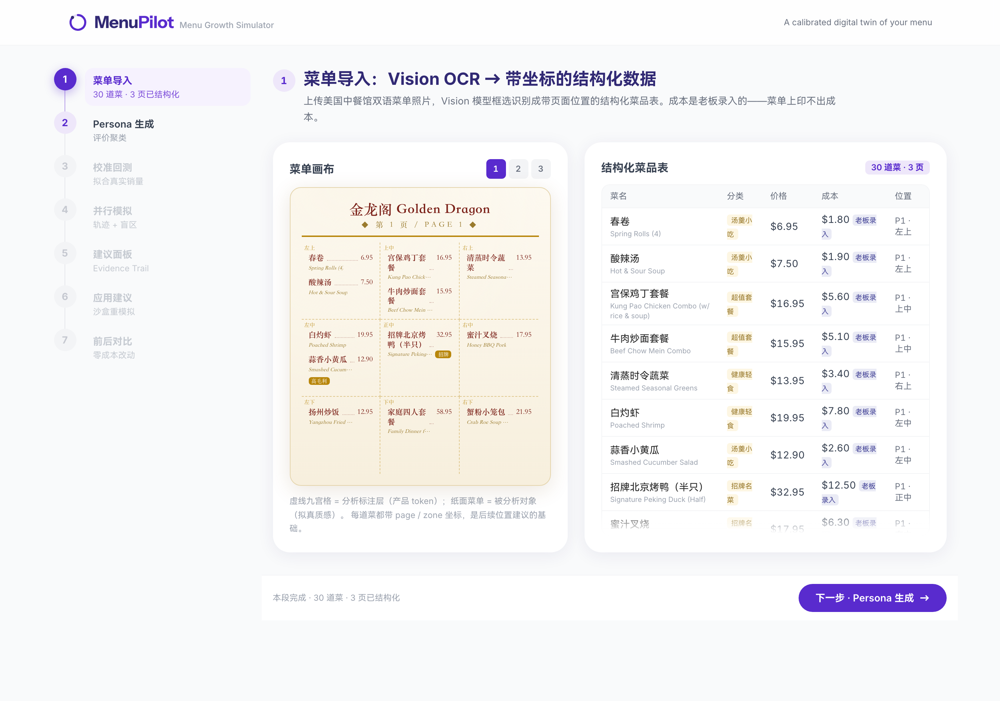
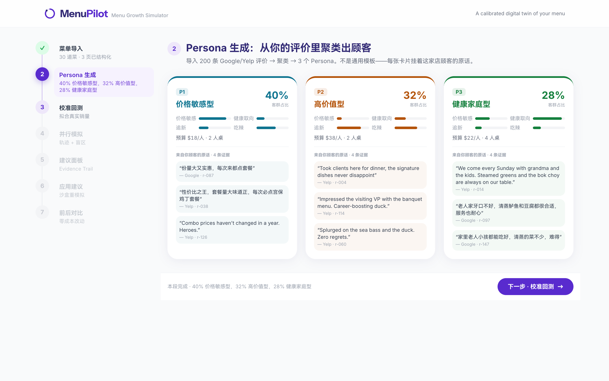
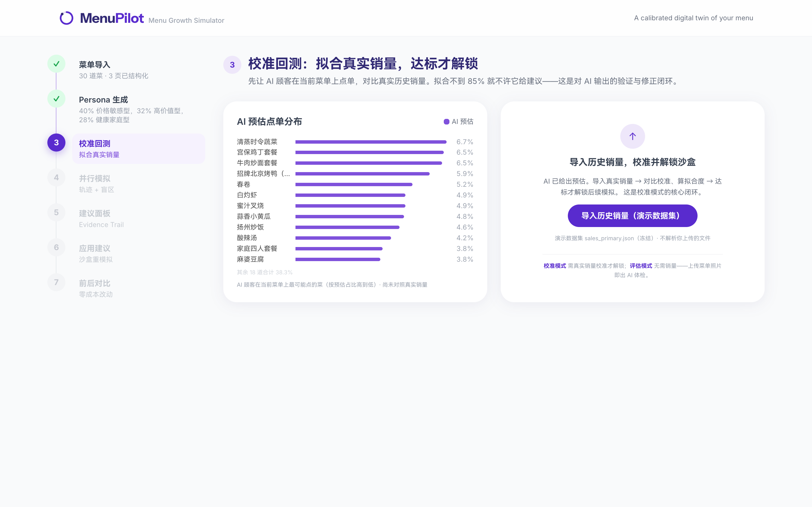
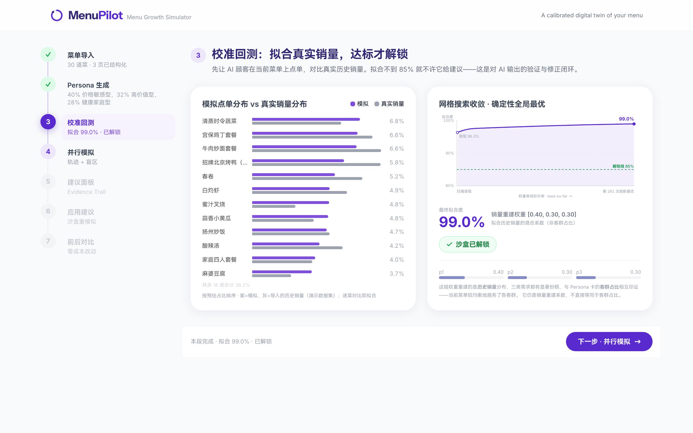
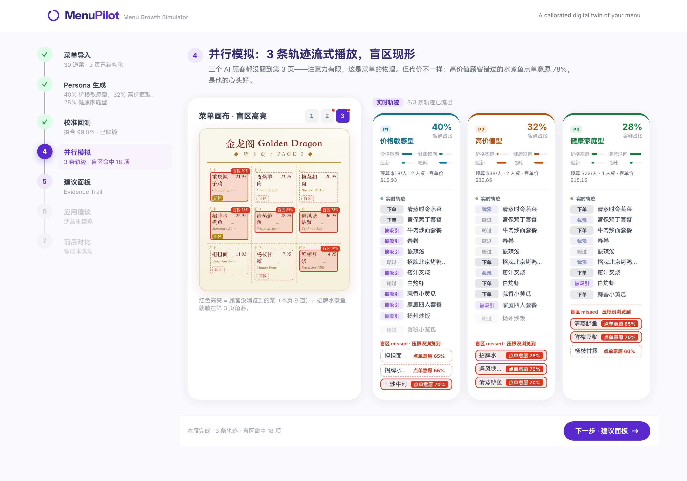
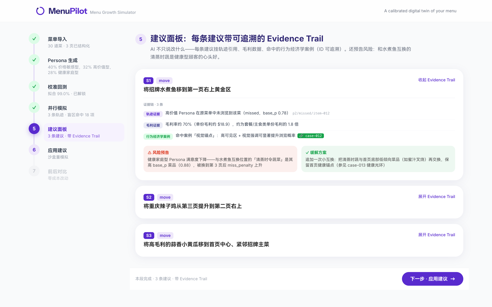
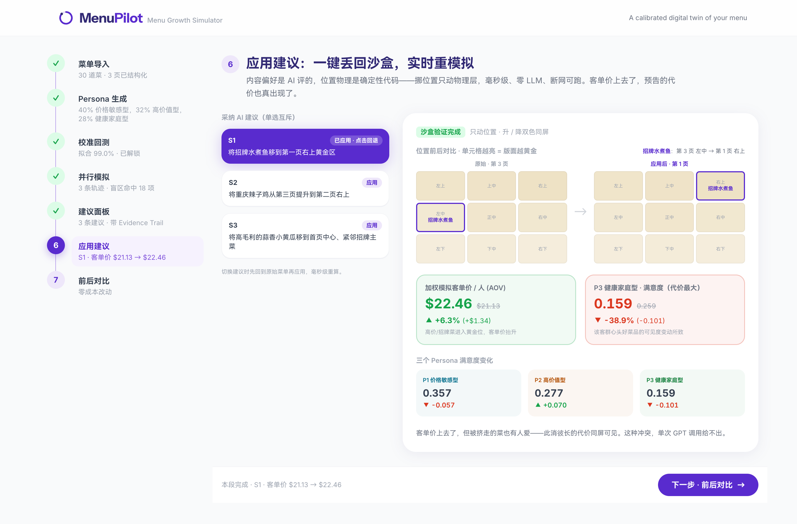
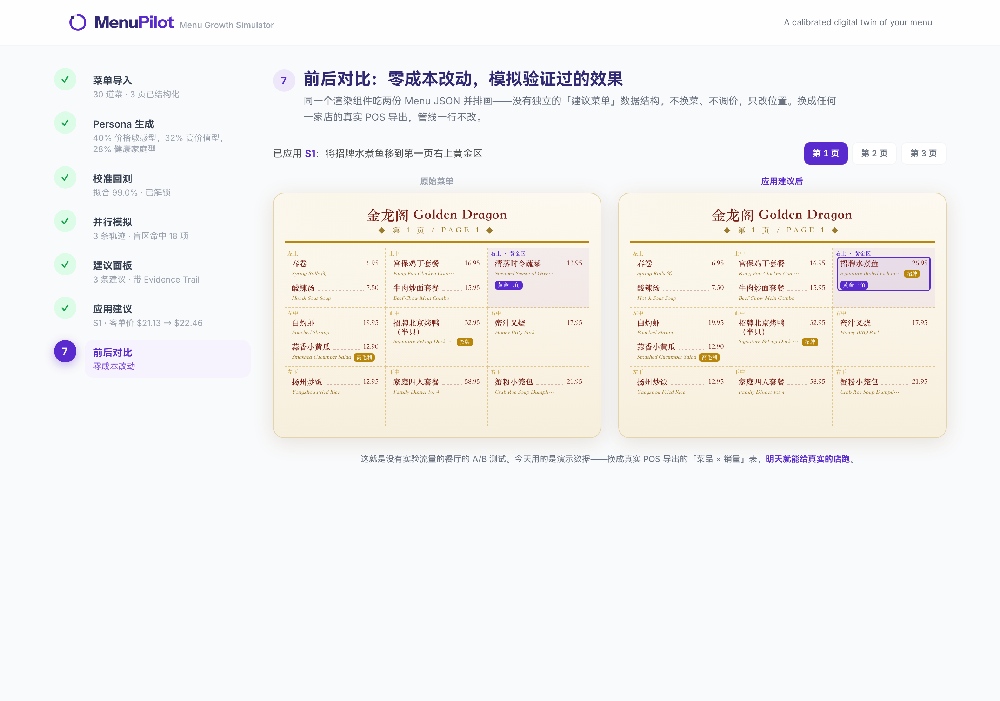
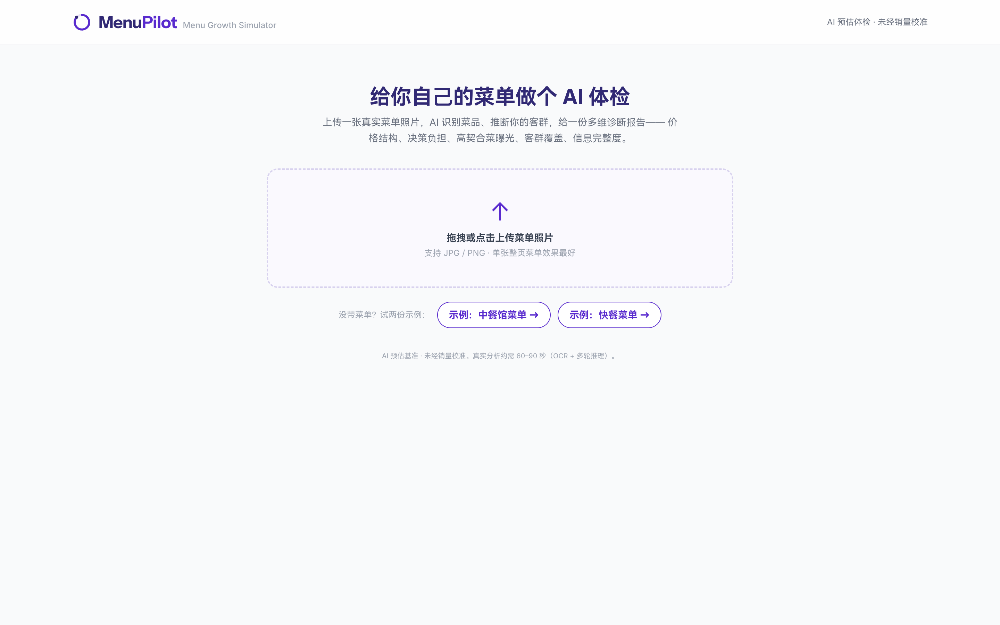
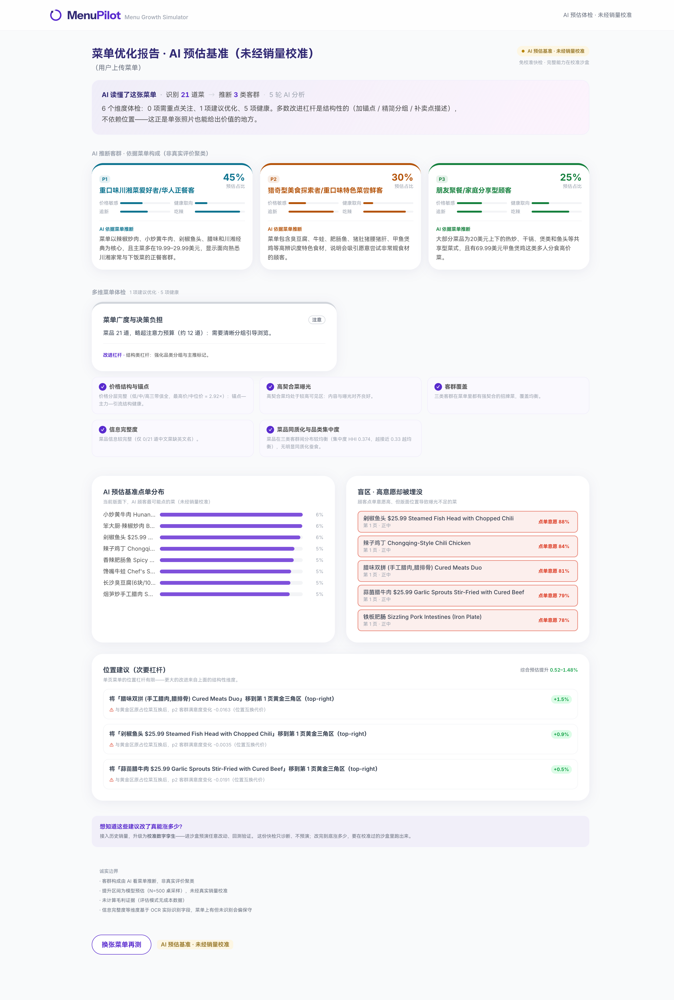
